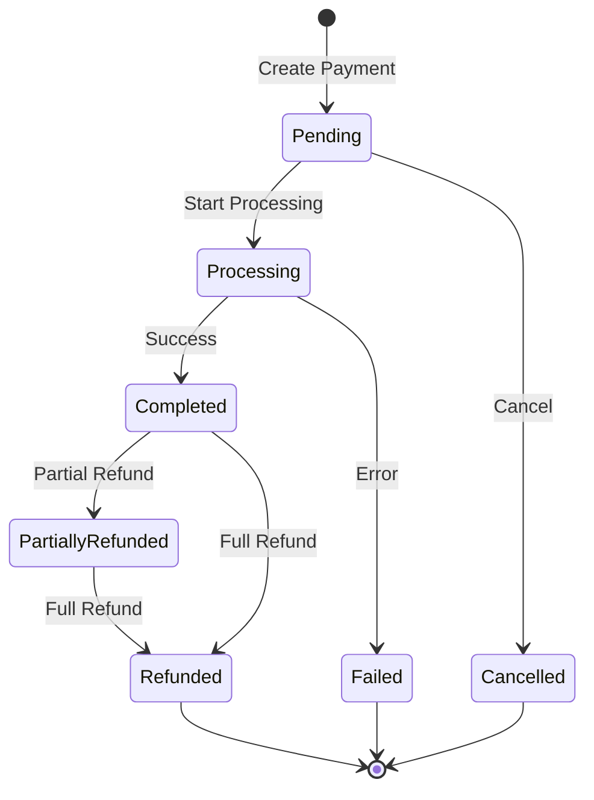

# Payment System API Documentation
## Comprehensive Guide to Deshio ERP Payment Architecture

> **Version:** 1.0  
> **Last Updated:** November 12, 2025  
> **Base URL:** `/api`  
> **Authentication:** Required (`auth:api` middleware)

---

## Table of Contents

1. [System Overview](#system-overview)
2. [Payment Architecture](#payment-architecture)
3. [Payment Methods API](#payment-methods-api)
4. [Order Payments API](#order-payments-api)
5. [Advanced Payment Processing](#advanced-payment-processing)
6. [Split Payment System](#split-payment-system)
7. [Cash Denomination Tracking](#cash-denomination-tracking)
8. [Vendor Payments API](#vendor-payments-api)
9. [Expense Payments API](#expense-payments-api)
10. [Payment Utilities](#payment-utilities)
11. [Data Models](#data-models)
12. [Workflows & Examples](#workflows--examples)
13. [Error Handling](#error-handling)

---

## System Overview

### Payment System Components

The Deshio ERP payment system is a **multi-layered architecture** designed to handle complex payment scenarios across three sales channels:

1. **Counter Sales** - In-person retail transactions
2. **Social Commerce** - Facebook/Instagram/WhatsApp orders
3. **E-commerce** - Online store orders

### Key Features

- ✅ **Multiple Payment Methods** - Cash, Card, Bank Transfer, Mobile Banking, Digital Wallets
- ✅ **Split Payments** - Pay with multiple methods in a single transaction
- ✅ **Partial Payments** - Installment plans and progressive payments
- ✅ **Cash Denomination Tracking** - Detailed tracking of bills and coins
- ✅ **Fee Calculation** - Automatic fee computation per payment method
- ✅ **Refund Management** - Full and partial refunds with history
- ✅ **Customer Type Restrictions** - Method availability by customer type
- ✅ **Payment Status Tracking** - Complete lifecycle management
- ✅ **Vendor Payment Management** - Purchase order payments and advances
- ✅ **Expense Payments** - Business expense tracking

### Payment Flow States

```
Pending → Processing → Completed
              ↓
            Failed
              ↓
          Cancelled

Completed → Partially Refunded → Refunded
```

---

## Payment Architecture

### Entity Relationship Diagram

```
┌─────────────────┐
│  PaymentMethod  │
│  (6 types)      │
└────────┬────────┘
         │ 1:N
         ↓
┌─────────────────┐       ┌──────────────────┐
│  OrderPayment   │ 1:N   │  PaymentSplit    │
│  (Main Payment) │←──────│  (Split Method)  │
└────────┬────────┘       └────────┬─────────┘
         │ 1:N                     │ 1:N
         ↓                         ↓
┌─────────────────┐       ┌──────────────────┐
│ CashDenomination│       │ CashDenomination │
│ (Bill/Coin)     │       │ (For Split)      │
└─────────────────┘       └──────────────────┘
```

### Payment Hierarchy

1. **Payment Method** - Defines how payment can be made (Cash, Card, etc.)
2. **Order Payment** - Main payment record for an order
3. **Payment Split** - Individual payment method in a split transaction
4. **Cash Denomination** - Breakdown of cash received/returned

---

## Payment Methods API

### 1. Get Payment Methods by Customer Type

Retrieves available payment methods for a specific customer type.

**Endpoint:** `GET /payments/methods`

**Query Parameters:**
| Parameter | Type | Required | Description |
|-----------|------|----------|-------------|
| `customer_type` | string | Yes | `counter`, `social_commerce`, or `ecommerce` |

**Request Example:**
```http
GET /api/payments/methods?customer_type=counter
Authorization: Bearer {token}
```

**Response:**
```json
{
  "success": true,
  "data": [
    {
      "id": 1,
      "code": "cash",
      "name": "Cash",
      "type": "cash",
      "description": "Cash payment",
      "allowed_customer_types": ["counter", "social_commerce", "ecommerce"],
      "is_active": true,
      "requires_reference": false,
      "supports_partial": true,
      "min_amount": null,
      "max_amount": null,
      "fixed_fee": 0.00,
      "percentage_fee": 0.00,
      "sort_order": 1
    },
    {
      "id": 2,
      "code": "card",
      "name": "Card Payment",
      "type": "card",
      "description": "Credit/Debit card payment",
      "allowed_customer_types": ["counter", "social_commerce", "ecommerce"],
      "is_active": true,
      "requires_reference": true,
      "supports_partial": true,
      "min_amount": null,
      "max_amount": null,
      "fixed_fee": 0.00,
      "percentage_fee": 1.50,
      "sort_order": 2
    },
    {
      "id": 5,
      "code": "mobile_banking",
      "name": "Mobile Banking",
      "type": "mobile_banking",
      "description": "Mobile banking payment (bKash, Nagad, etc.)",
      "allowed_customer_types": ["counter", "social_commerce", "ecommerce"],
      "is_active": true,
      "requires_reference": true,
      "supports_partial": true,
      "min_amount": null,
      "max_amount": null,
      "fixed_fee": 2.00,
      "percentage_fee": 1.00,
      "sort_order": 5
    }
  ],
  "meta": {
    "total": 3,
    "customer_type": "counter"
  }
}
```

### Payment Method Types

| Type | Code | Description | Customer Types | Requires Reference | Common Use |
|------|------|-------------|----------------|-------------------|-----------|
| **Cash** | `cash` | Physical currency | All | No | Counter sales |
| **Card** | `card` | Credit/Debit cards | All | Yes | POS terminals |
| **Bank Transfer** | `bank_transfer` | Direct bank transfer | E-commerce | Yes | Large orders |
| **Online Banking** | `online_banking` | Internet banking | Social Commerce | Yes | Online orders |
| **Mobile Banking** | `mobile_banking` | bKash, Nagad, Rocket | All | Yes | Bangladesh market |
| **Digital Wallet** | `digital_wallet` | PayPal, Stripe, etc. | All | Yes | Global payments |

### Fee Calculation Formula

```
Total Fee = Fixed Fee + (Amount × Percentage Fee / 100)
Net Amount = Gross Amount - Total Fee
```

**Example:**
```
Payment: 1000 BDT via Mobile Banking
Fixed Fee: 2.00 BDT
Percentage Fee: 1.0%

Total Fee = 2.00 + (1000 × 1.0 / 100) = 2.00 + 10.00 = 12.00 BDT
Net Amount = 1000 - 12 = 988.00 BDT
```

---

## Order Payments API

### 2. Get All Payments for an Order

Retrieve all payment records associated with an order.

**Endpoint:** `GET /orders/{order_id}/payments`

**Response:**
```json
{
  "success": true,
  "data": {
    "order_id": 7,
    "order_number": "ORD-20251112-A7F3",
    "total_amount": 5000.00,
    "payments": [
      {
        "id": 12,
        "payment_number": "PAY-20251112-8A3F4C2D",
        "amount": 3000.00,
        "fee_amount": 0.00,
        "net_amount": 3000.00,
        "payment_method": {
          "id": 1,
          "name": "Cash",
          "type": "cash"
        },
        "status": "completed",
        "is_partial_payment": true,
        "payment_type": "partial",
        "order_balance_before": 5000.00,
        "order_balance_after": 2000.00,
        "processed_by": "John Doe",
        "processed_at": "2025-11-12T10:30:00Z",
        "completed_at": "2025-11-12T10:30:15Z"
      },
      {
        "id": 13,
        "payment_number": "PAY-20251112-9B4E5D3F",
        "amount": 2000.00,
        "fee_amount": 0.00,
        "net_amount": 2000.00,
        "payment_method": {
          "id": 1,
          "name": "Cash",
          "type": "cash"
        },
        "status": "completed",
        "is_partial_payment": true,
        "payment_type": "partial",
        "order_balance_before": 2000.00,
        "order_balance_after": 0.00,
        "processed_by": "John Doe",
        "processed_at": "2025-11-12T14:20:00Z",
        "completed_at": "2025-11-12T14:20:10Z"
      }
    ],
    "payment_summary": {
      "total_paid": 5000.00,
      "total_fees": 0.00,
      "total_net": 5000.00,
      "remaining_balance": 0.00,
      "payment_status": "fully_paid"
    }
  }
}
```

### 3. Process Single Payment

Create and process a payment for an order using a single payment method.

**Endpoint:** `POST /orders/{order_id}/payments`

**Request Body:**
```json
{
  "payment_method_id": 1,
  "amount": 1500.00,
  "payment_type": "full",
  "transaction_reference": "TXN-123456",
  "payment_data": {
    "notes": "Customer paid in full"
  }
}
```

**Response:**
```json
{
  "success": true,
  "message": "Payment processed successfully",
  "data": {
    "id": 14,
    "payment_number": "PAY-20251112-C5D6E7F8",
    "order_id": 8,
    "amount": 1500.00,
    "fee_amount": 0.00,
    "net_amount": 1500.00,
    "status": "completed",
    "payment_method": {
      "id": 1,
      "name": "Cash",
      "type": "cash"
    },
    "order_balance_before": 1500.00,
    "order_balance_after": 0.00,
    "processed_at": "2025-11-12T15:45:00Z",
    "completed_at": "2025-11-12T15:45:05Z"
  }
}
```

### 4. Process Multiple Payments

Process multiple partial payments in one request.

**Endpoint:** `POST /orders/{order_id}/payments/multiple`

**Request Body:**
```json
{
  "payments": [
    {
      "payment_method_id": 1,
      "amount": 1000.00,
      "payment_data": {
        "notes": "First installment"
      }
    },
    {
      "payment_method_id": 5,
      "amount": 500.00,
      "transaction_reference": "BKASH-789456",
      "payment_data": {
        "provider": "bKash",
        "phone": "01712345678"
      }
    }
  ]
}
```

**Response:**
```json
{
  "success": true,
  "message": "3 payments processed successfully",
  "data": {
    "order_id": 9,
    "payments_created": 2,
    "total_amount_paid": 1500.00,
    "remaining_balance": 500.00,
    "payments": [
      {
        "id": 15,
        "payment_number": "PAY-20251112-D7E8F9A1",
        "amount": 1000.00,
        "status": "completed"
      },
      {
        "id": 16,
        "payment_number": "PAY-20251112-E8F9A1B2",
        "amount": 500.00,
        "status": "completed"
      }
    ]
  }
}
```

### 5. Setup Installment Plan

Create an installment payment plan for an order.

**Endpoint:** `POST /orders/{order_id}/payments/installment/setup`

**Request Body:**
```json
{
  "number_of_installments": 3,
  "first_installment_amount": 2000.00,
  "installment_frequency": "monthly",
  "start_date": "2025-11-15",
  "payment_method_id": 1,
  "notes": "3-month installment plan"
}
```

**Response:**
```json
{
  "success": true,
  "message": "Installment plan created successfully",
  "data": {
    "order_id": 10,
    "total_amount": 5000.00,
    "number_of_installments": 3,
    "installment_schedule": [
      {
        "installment_number": 1,
        "amount": 2000.00,
        "due_date": "2025-11-15",
        "status": "pending"
      },
      {
        "installment_number": 2,
        "amount": 1500.00,
        "due_date": "2025-12-15",
        "status": "pending"
      },
      {
        "installment_number": 3,
        "amount": 1500.00,
        "due_date": "2026-01-15",
        "status": "pending"
      }
    ]
  }
}
```

### 6. Add Installment Payment

Record a payment for an existing installment plan.

**Endpoint:** `POST /orders/{order_id}/payments/installment`

**Request Body:**
```json
{
  "installment_number": 1,
  "payment_method_id": 1,
  "amount": 2000.00,
  "transaction_reference": "INS-001"
}
```

### 7. Add Partial Payment

Add a partial payment without an installment plan.

**Endpoint:** `POST /orders/{order_id}/payments/partial`

**Request Body:**
```json
{
  "payment_method_id": 1,
  "amount": 1000.00,
  "notes": "Partial payment received"
}
```

### 8. Refund Payment

Process a full or partial refund for a completed payment.

**Endpoint:** `POST /payments/{payment_id}/refund`

**Request Body:**
```json
{
  "refund_amount": 500.00,
  "reason": "Product defect",
  "refund_method": "original",
  "notes": "Partial refund approved by manager"
}
```

**Response:**
```json
{
  "success": true,
  "message": "Refund processed successfully",
  "data": {
    "payment_id": 12,
    "original_amount": 1500.00,
    "refunded_amount": 500.00,
    "remaining_refundable": 1000.00,
    "refund_status": "partially_refunded",
    "refund_history": [
      {
        "amount": 500.00,
        "reason": "Product defect",
        "refunded_at": "2025-11-12T16:30:00Z",
        "refunded_by": 3
      }
    ]
  }
}
```

### 9. Get Available Payment Methods for Order

Get payment methods available for a specific order based on customer type.

**Endpoint:** `GET /orders/{order_id}/payments/methods`

**Response:**
```json
{
  "success": true,
  "data": {
    "order_id": 7,
    "customer_type": "counter",
    "available_methods": [
      {
        "id": 1,
        "name": "Cash",
        "type": "cash",
        "can_use": true,
        "reason": null
      },
      {
        "id": 2,
        "name": "Card Payment",
        "type": "card",
        "can_use": true,
        "calculated_fee": 22.50,
        "net_amount": 1477.50
      }
    ]
  }
}
```

---

## Advanced Payment Processing

### 10. Get Payment Details (Advanced)

Get detailed payment information including splits and cash denominations.

**Endpoint:** `GET /orders/{order_id}/payments/advanced`

**Response:**
```json
{
  "success": true,
  "data": {
    "payments": [
      {
        "id": 20,
        "payment_number": "PAY-20251112-F1A2B3C4",
        "amount": 2000.00,
        "status": "completed",
        "has_splits": true,
        "split_count": 2,
        "payment_splits": [
          {
            "id": 1,
            "payment_method": "Cash",
            "amount": 1500.00,
            "fee_amount": 0.00,
            "status": "completed",
            "has_cash_denominations": true
          },
          {
            "id": 2,
            "payment_method": "Card Payment",
            "amount": 500.00,
            "fee_amount": 7.50,
            "status": "completed",
            "transaction_reference": "CARD-TXN-123"
          }
        ]
      }
    ]
  }
}
```

### 11. Create Simple Payment (Advanced)

Create a payment using the advanced payment controller with single method.

**Endpoint:** `POST /orders/{order_id}/payments/simple`

**Request Body:**
```json
{
  "payment_method_id": 1,
  "amount": 1500.00,
  "payment_data": {
    "notes": "Counter sale"
  },
  "cash_denominations": [
    {
      "denomination_value": 1000,
      "quantity": 1,
      "type": "received"
    },
    {
      "denomination_value": 500,
      "quantity": 1,
      "type": "received"
    }
  ]
}
```

### 12. Create Split Payment

Create a payment using multiple payment methods in a single transaction.

**Endpoint:** `POST /orders/{order_id}/payments/split`

**Request Body:**
```json
{
  "total_amount": 2000.00,
  "splits": [
    {
      "payment_method_id": 1,
      "amount": 1500.00,
      "payment_data": {
        "notes": "Cash portion"
      },
      "cash_denominations": [
        {
          "denomination_value": 1000,
          "quantity": 1,
          "type": "received"
        },
        {
          "denomination_value": 500,
          "quantity": 1,
          "type": "received"
        }
      ]
    },
    {
      "payment_method_id": 2,
      "amount": 500.00,
      "payment_data": {
        "card_type": "Visa",
        "last_4_digits": "1234"
      },
      "transaction_reference": "CARD-789456"
    }
  ]
}
```

**Response:**
```json
{
  "success": true,
  "message": "Split payment created successfully",
  "data": {
    "payment_id": 21,
    "payment_number": "PAY-20251112-G2B3C4D5",
    "total_amount": 2000.00,
    "total_fee": 7.50,
    "total_net": 1992.50,
    "splits": [
      {
        "split_id": 3,
        "sequence": 1,
        "method": "Cash",
        "amount": 1500.00,
        "fee": 0.00,
        "status": "completed"
      },
      {
        "split_id": 4,
        "sequence": 2,
        "method": "Card Payment",
        "amount": 500.00,
        "fee": 7.50,
        "status": "completed"
      }
    ],
    "order_balance_after": 0.00
  }
}
```

### 13. Get Payment Detail with Splits

Get complete payment details including all splits and cash tracking.

**Endpoint:** `GET /orders/{order_id}/payments/{payment_id}/details`

**Response:**
```json
{
  "success": true,
  "data": {
    "id": 21,
    "payment_number": "PAY-20251112-G2B3C4D5",
    "order_id": 15,
    "amount": 2000.00,
    "status": "completed",
    "is_split_payment": true,
    "payment_splits": [
      {
        "id": 3,
        "sequence": 1,
        "payment_method": {
          "id": 1,
          "name": "Cash",
          "type": "cash"
        },
        "amount": 1500.00,
        "fee_amount": 0.00,
        "net_amount": 1500.00,
        "status": "completed",
        "cash_denominations": {
          "received": [
            {
              "denomination": 1000,
              "quantity": 1,
              "total": 1000.00,
              "type": "note"
            },
            {
              "denomination": 500,
              "quantity": 1,
              "total": 500.00,
              "type": "note"
            }
          ],
          "change": [],
          "total_received": 1500.00,
          "total_change": 0.00
        }
      },
      {
        "id": 4,
        "sequence": 2,
        "payment_method": {
          "id": 2,
          "name": "Card Payment",
          "type": "card"
        },
        "amount": 500.00,
        "fee_amount": 7.50,
        "net_amount": 492.50,
        "status": "completed",
        "transaction_reference": "CARD-789456"
      }
    ]
  }
}
```

### 14. Process Payment

Move a payment from pending to processing status.

**Endpoint:** `POST /orders/{order_id}/payments/{payment_id}/process`

### 15. Complete Payment

Mark a payment as completed (from processing status).

**Endpoint:** `POST /orders/{order_id}/payments/{payment_id}/complete`

**Request Body:**
```json
{
  "transaction_reference": "TXN-COMPLETED-123",
  "external_reference": "EXT-REF-456"
}
```

### 16. Fail Payment

Mark a payment as failed with reason.

**Endpoint:** `POST /orders/{order_id}/payments/{payment_id}/fail`

**Request Body:**
```json
{
  "failure_reason": "Card declined by bank"
}
```

### 17. Refund Payment (Advanced)

Process refund using advanced payment controller.

**Endpoint:** `POST /orders/{order_id}/payments/{payment_id}/refund`

**Request Body:**
```json
{
  "refund_amount": 500.00,
  "reason": "Customer requested refund"
}
```

---

## Split Payment System

### Understanding Split Payments

Split payments allow customers to pay using **multiple payment methods** in a single transaction.

**Example Scenario:**
```
Total Order: 3000 BDT
├── Cash: 2000 BDT (no fee)
├── Card: 800 BDT (1.5% fee = 12 BDT)
└── Mobile Banking: 200 BDT (2 BDT fixed + 1% = 4 BDT)

Total Fees: 16 BDT
Net Amount: 2984 BDT
```

### Split Payment Workflow

```
1. Create Order Payment
   └── Create Payment Splits (one per method)
       ├── Split 1: Cash Payment
       ├── Split 2: Card Payment
       └── Split 3: Mobile Banking

2. Process Each Split
   ├── Split 1: Complete (instant)
   ├── Split 2: Complete (after card authorization)
   └── Split 3: Complete (after mobile confirmation)

3. Update Parent Payment Status
   └── When all splits complete → Payment complete
```

### Split Payment Features

- **Independent Processing** - Each split is processed separately
- **Separate Fee Calculation** - Fees calculated per method
- **Sequential Tracking** - Split sequence numbers for ordering
- **Individual Status** - Each split has its own status
- **Separate References** - Transaction references per split
- **Cash Tracking** - Cash denominations per cash split

---

## Cash Denomination Tracking

### 18. Get Cash Denominations for Payment

Retrieve cash denomination breakdown for a payment.

**Endpoint:** `GET /orders/{order_id}/payments/{payment_id}/cash-denominations`

**Response:**
```json
{
  "success": true,
  "data": {
    "payment_id": 21,
    "payment_split_id": 3,
    "received": {
      "notes": [
        {
          "denomination": 1000,
          "quantity": 2,
          "total": 2000.00,
          "currency": "BDT"
        },
        {
          "denomination": 500,
          "quantity": 1,
          "total": 500.00,
          "currency": "BDT"
        }
      ],
      "coins": [],
      "total": 2500.00
    },
    "change": {
      "notes": [
        {
          "denomination": 100,
          "quantity": 5,
          "total": 500.00,
          "currency": "BDT"
        }
      ],
      "coins": [],
      "total": 500.00
    },
    "net_cash": 2000.00,
    "recorded_by": "John Doe",
    "recorded_at": "2025-11-12T15:30:00Z"
  }
}
```

### Cash Denomination Use Cases

1. **Exact Change** - Customer pays exact amount
2. **Requires Change** - Customer gives larger bills, receives change
3. **Multiple Denominations** - Mix of notes and coins
4. **Cash Drawer Reconciliation** - Daily cash counting
5. **Audit Trail** - Complete cash flow tracking

### Supported Currencies

| Currency | Code | Denominations (Notes) | Denominations (Coins) |
|----------|------|----------------------|----------------------|
| **Bangladeshi Taka** | BDT | 1000, 500, 100, 50, 20, 10, 5, 2, 1 | 1 |
| **US Dollar** | USD | 100, 50, 20, 10, 5, 1 | 0.25, 0.10, 0.05, 0.01 |

---

## Payment Utilities

### 19. Calculate Change

Calculate optimal change denominations for a given amount.

**Endpoint:** `POST /payment-utils/calculate-change`

**Request Body:**
```json
{
  "amount_received": 2500.00,
  "amount_due": 1850.00,
  "currency": "BDT"
}
```

**Response:**
```json
{
  "success": true,
  "data": {
    "change_amount": 650.00,
    "denominations": [
      {
        "denomination": 500,
        "quantity": 1,
        "total": 500.00,
        "type": "note"
      },
      {
        "denomination": 100,
        "quantity": 1,
        "total": 100.00,
        "type": "note"
      },
      {
        "denomination": 50,
        "quantity": 1,
        "total": 50.00,
        "type": "note"
      }
    ]
  }
}
```

### 20. Get Payment Statistics

Get overall payment statistics and metrics.

**Endpoint:** `GET /payments/stats`

**Query Parameters:**
- `start_date` (optional)
- `end_date` (optional)
- `store_id` (optional)
- `payment_method_id` (optional)

**Response:**
```json
{
  "success": true,
  "data": {
    "period": {
      "start": "2025-11-01",
      "end": "2025-11-12"
    },
    "total_payments": 156,
    "total_amount": 342500.00,
    "total_fees": 5234.50,
    "total_net": 337265.50,
    "by_method": [
      {
        "method": "Cash",
        "count": 89,
        "amount": 187000.00,
        "percentage": 54.6
      },
      {
        "method": "Card Payment",
        "count": 42,
        "amount": 105500.00,
        "percentage": 30.8
      },
      {
        "method": "Mobile Banking",
        "count": 25,
        "amount": 50000.00,
        "percentage": 14.6
      }
    ],
    "by_status": {
      "completed": 142,
      "processing": 8,
      "pending": 4,
      "failed": 2
    },
    "refunds": {
      "count": 7,
      "total_amount": 8500.00
    }
  }
}
```

### 21. Get Overdue Payments

Retrieve payments that are overdue (for installment plans).

**Endpoint:** `GET /payments/overdue`

**Response:**
```json
{
  "success": true,
  "data": [
    {
      "order_id": 45,
      "order_number": "ORD-20251015-B8C9",
      "customer": {
        "id": 12,
        "name": "Jane Smith",
        "phone": "01812345678"
      },
      "installment_number": 2,
      "due_date": "2025-11-10",
      "days_overdue": 2,
      "amount_due": 1500.00,
      "remaining_balance": 3000.00
    }
  ],
  "meta": {
    "total": 1,
    "total_overdue_amount": 1500.00
  }
}
```

---

## Vendor Payments API

### 22. List Vendor Payments

Get all payments made to vendors for purchase orders.

**Endpoint:** `GET /vendor-payments`

**Query Parameters:**
- `vendor_id` (optional)
- `status` (optional): `pending`, `completed`, `cancelled`
- `payment_type` (optional): `full`, `partial`, `advance`
- `start_date` (optional)
- `end_date` (optional)
- `page` (default: 1)
- `per_page` (default: 15)

**Response:**
```json
{
  "success": true,
  "data": [
    {
      "id": 5,
      "payment_number": "VP-20251112-001",
      "vendor": {
        "id": 3,
        "name": "Fashion Fabrics Ltd",
        "code": "VEN-003"
      },
      "purchase_order": {
        "id": 12,
        "po_number": "PO-20251110-005",
        "total_amount": 50000.00
      },
      "amount": 25000.00,
      "payment_type": "partial",
      "payment_method": "bank_transfer",
      "status": "completed",
      "payment_date": "2025-11-12",
      "transaction_reference": "BANK-TXN-789456",
      "notes": "50% advance payment"
    }
  ],
  "meta": {
    "current_page": 1,
    "total": 15,
    "per_page": 15
  }
}
```

### 23. Create Vendor Payment

Create a payment for a purchase order.

**Endpoint:** `POST /vendor-payments`

**Request Body:**
```json
{
  "purchase_order_id": 12,
  "amount": 25000.00,
  "payment_type": "advance",
  "payment_method": "bank_transfer",
  "payment_date": "2025-11-12",
  "transaction_reference": "BANK-TXN-789456",
  "bank_details": {
    "bank_name": "City Bank",
    "account_number": "1234567890",
    "branch": "Gulshan"
  },
  "notes": "Advance payment for fabric order"
}
```

### 24. Get Vendor Payment Details

**Endpoint:** `GET /vendor-payments/{id}`

### 25. Get Payments by Purchase Order

**Endpoint:** `GET /vendor-payments/purchase-order/{purchase_order_id}`

### 26. Get Outstanding Vendor Payments

Get all unpaid or partially paid amounts for a vendor.

**Endpoint:** `GET /vendor-payments/outstanding/{vendor_id}`

**Response:**
```json
{
  "success": true,
  "data": {
    "vendor_id": 3,
    "vendor_name": "Fashion Fabrics Ltd",
    "outstanding_orders": [
      {
        "purchase_order_id": 12,
        "po_number": "PO-20251110-005",
        "total_amount": 50000.00,
        "paid_amount": 25000.00,
        "outstanding_amount": 25000.00,
        "status": "partially_paid"
      }
    ],
    "total_outstanding": 25000.00,
    "advance_balance": 0.00
  }
}
```

### 27. Allocate Advance Payment

Allocate an advance payment to a specific purchase order.

**Endpoint:** `POST /vendor-payments/{id}/allocate`

**Request Body:**
```json
{
  "purchase_order_id": 15,
  "allocation_amount": 10000.00,
  "notes": "Allocating advance to new PO"
}
```

### 28. Cancel Vendor Payment

**Endpoint:** `POST /vendor-payments/{id}/cancel`

**Request Body:**
```json
{
  "reason": "Duplicate payment created",
  "refund_amount": 25000.00
}
```

### 29. Refund Vendor Payment

**Endpoint:** `POST /vendor-payments/{id}/refund`

### 30. Vendor Payment Statistics

**Endpoint:** `GET /vendor-payments/stats`

---

## Expense Payments API

### 31. Add Expense Payment

Record a payment for a business expense.

**Endpoint:** `POST /expenses/{expense_id}/payments`

**Request Body:**
```json
{
  "amount": 5000.00,
  "payment_method": "bank_transfer",
  "payment_date": "2025-11-12",
  "transaction_reference": "EXP-BANK-123",
  "notes": "Rent payment for November"
}
```

**Response:**
```json
{
  "success": true,
  "message": "Expense payment recorded",
  "data": {
    "expense_id": 8,
    "payment_id": 3,
    "amount": 5000.00,
    "paid_amount": 5000.00,
    "remaining_amount": 0.00,
    "payment_status": "fully_paid"
  }
}
```

---

## Data Models

### OrderPayment Model

```php
{
  "id": integer,
  "payment_number": string,              // Unique identifier
  "order_id": integer,
  "payment_method_id": integer,
  "customer_id": integer,
  "store_id": integer,
  "processed_by": integer,               // Employee ID
  
  // Amounts
  "amount": decimal,                     // Gross amount
  "fee_amount": decimal,                 // Payment method fees
  "net_amount": decimal,                 // Amount - Fees
  
  // Payment Type
  "is_partial_payment": boolean,
  "installment_number": integer|null,
  "payment_type": enum,                  // 'full', 'partial', 'installment'
  
  // Installment Fields
  "payment_due_date": date|null,
  "payment_received_date": date|null,
  "expected_installment_amount": decimal|null,
  "is_late_payment": boolean,
  "days_late": integer|null,
  
  // Balance Tracking
  "order_balance_before": decimal,
  "order_balance_after": decimal,
  
  // Status
  "status": enum,                        // 'pending', 'processing', 'completed', 'failed', 'cancelled', 'refunded', 'partially_refunded'
  
  // References
  "transaction_reference": string|null,
  "external_reference": string|null,
  
  // Timestamps
  "processed_at": datetime|null,
  "completed_at": datetime|null,
  "failed_at": datetime|null,
  
  // Metadata
  "payment_data": json,
  "metadata": json,
  "notes": text|null,
  "failure_reason": text|null,
  "status_history": json,
  
  // Refund Tracking
  "refunded_amount": decimal,
  "refund_history": json,
  
  // Soft Delete
  "deleted_at": datetime|null,
  "created_at": datetime,
  "updated_at": datetime
}
```

### PaymentSplit Model

```php
{
  "id": integer,
  "order_payment_id": integer,
  "payment_method_id": integer,
  "store_id": integer,
  
  // Amounts
  "amount": decimal,
  "fee_amount": decimal,
  "net_amount": decimal,
  
  // Split Info
  "split_sequence": integer,             // Order of split (1, 2, 3...)
  
  // Status
  "status": enum,                        // 'pending', 'completed', 'failed', 'refunded', 'partially_refunded'
  
  // References
  "transaction_reference": string|null,
  "external_reference": string|null,
  
  // Timestamps
  "processed_at": datetime|null,
  "completed_at": datetime|null,
  "failed_at": datetime|null,
  
  // Metadata
  "payment_data": json,
  "metadata": json,
  "notes": text|null,
  "failure_reason": text|null,
  
  // Refund Tracking
  "refunded_amount": decimal,
  "refund_history": json,
  
  "created_at": datetime,
  "updated_at": datetime
}
```

### CashDenomination Model

```php
{
  "id": integer,
  "payment_split_id": integer|null,
  "order_payment_id": integer|null,
  "store_id": integer,
  "recorded_by": integer,                // Employee ID
  
  // Type
  "type": enum,                          // 'received', 'change'
  "cash_type": enum,                     // 'note', 'coin'
  "currency": string,                    // 'BDT', 'USD', etc.
  
  // Denomination
  "denomination_value": decimal,         // 1000, 500, 100, 50, etc.
  "quantity": integer,
  "total_amount": decimal,               // value × quantity
  
  // Metadata
  "notes": text|null,
  "metadata": json,
  
  "created_at": datetime,
  "updated_at": datetime
}
```

---

## Workflows & Examples

### Workflow 1: Simple Counter Sale (Cash Payment)

```
1. Create Order
   POST /orders
   {
     "customer_id": 5,
     "store_id": 1,
     "sale_channel": "counter",
     "items": [...]
   }

2. Process Payment
   POST /orders/7/payments/simple
   {
     "payment_method_id": 1,
     "amount": 1500.00,
     "cash_denominations": [
       {"denomination_value": 1000, "quantity": 1, "type": "received"},
       {"denomination_value": 500, "quantity": 1, "type": "received"}
     ]
   }

3. Complete Order
   PATCH /orders/7/complete
```

### Workflow 2: Split Payment (Cash + Card)

```
1. Create Order
   Total: 3000 BDT

2. Create Split Payment
   POST /orders/8/payments/split
   {
     "total_amount": 3000.00,
     "splits": [
       {
         "payment_method_id": 1,  // Cash
         "amount": 2000.00,
         "cash_denominations": [...]
       },
       {
         "payment_method_id": 2,  // Card
         "amount": 1000.00,
         "transaction_reference": "CARD-123"
       }
     ]
   }

3. System processes each split:
   - Cash split: Completed immediately
   - Card split: Completed after authorization

4. Payment marked complete when all splits done
```

### Workflow 3: Installment Plan

```
1. Create Order (Total: 10,000 BDT)

2. Setup Installment Plan
   POST /orders/9/payments/installment/setup
   {
     "number_of_installments": 3,
     "first_installment_amount": 4000.00,
     "installment_frequency": "monthly"
   }

3. Customer Pays First Installment
   POST /orders/9/payments/installment
   {
     "installment_number": 1,
     "amount": 4000.00,
     "payment_method_id": 1
   }

4. Customer Pays Second Installment (after 1 month)
   POST /orders/9/payments/installment
   {
     "installment_number": 2,
     "amount": 3000.00,
     "payment_method_id": 5  // Mobile Banking
   }

5. Customer Pays Final Installment
   POST /orders/9/payments/installment
   {
     "installment_number": 3,
     "amount": 3000.00,
     "payment_method_id": 1
   }
```

### Workflow 4: Vendor Payment for Purchase Order

```
1. Create Purchase Order
   POST /purchase-orders
   Total: 50,000 BDT

2. Pay Advance (50%)
   POST /vendor-payments
   {
     "purchase_order_id": 12,
     "amount": 25000.00,
     "payment_type": "advance",
     "payment_method": "bank_transfer"
   }

3. Receive Goods
   POST /purchase-orders/12/receive

4. Pay Remaining Balance
   POST /vendor-payments
   {
     "purchase_order_id": 12,
     "amount": 25000.00,
     "payment_type": "partial"
   }
```

### Workflow 5: Refund Processing

```
1. Customer Returns Product
   POST /returns
   {
     "order_id": 7,
     "items": [...],
     "total_refund_amount": 500.00
   }

2. Process Refund
   POST /payments/12/refund
   {
     "refund_amount": 500.00,
     "reason": "Product return"
   }

3. Payment Status Updated
   Status: completed → partially_refunded
```

---

## Error Handling

### Common Error Codes

| Code | Status | Description |
|------|--------|-------------|
| `PAYMENT_METHOD_NOT_FOUND` | 404 | Payment method doesn't exist |
| `PAYMENT_METHOD_NOT_ALLOWED` | 403 | Method not allowed for customer type |
| `INSUFFICIENT_AMOUNT` | 400 | Payment amount less than minimum |
| `EXCEEDS_ORDER_BALANCE` | 400 | Payment exceeds remaining balance |
| `PAYMENT_ALREADY_COMPLETED` | 400 | Cannot modify completed payment |
| `SPLIT_TOTAL_MISMATCH` | 400 | Split amounts don't match total |
| `INVALID_REFUND_AMOUNT` | 400 | Refund exceeds paid amount |
| `TRANSACTION_FAILED` | 500 | Payment gateway error |
| `CASH_MISMATCH` | 400 | Cash denominations don't match amount |

### Error Response Format

```json
{
  "success": false,
  "error": {
    "code": "PAYMENT_METHOD_NOT_ALLOWED",
    "message": "Mobile Banking is not available for counter customers",
    "details": {
      "payment_method_id": 5,
      "customer_type": "counter",
      "allowed_types": ["counter", "social_commerce", "ecommerce"]
    }
  }
}
```

### Validation Rules

**Payment Amount:**
- Must be greater than 0
- Cannot exceed order balance
- Must respect payment method limits
- Split totals must match parent amount

**Payment Method:**
- Must be active
- Must be allowed for customer type
- Must support partial if partial payment

**Cash Denominations:**
- Total must match payment amount
- Denominations must be valid for currency
- Change must be calculated correctly

**Refunds:**
- Payment must be completed
- Refund amount ≤ refundable amount
- Reason must be provided

---

## Best Practices

### 1. Always Validate Payment Methods
Before creating payment, check if method is available for customer type:
```http
GET /orders/{order_id}/payments/methods
```

### 2. Use Split Payments for Multiple Methods
Don't create separate payments - use split payment API:
```http
POST /orders/{order_id}/payments/split
```

### 3. Track Cash Denominations
For cash payments, always record denominations:
```json
{
  "cash_denominations": [
    {"denomination_value": 1000, "quantity": 2, "type": "received"}
  ]
}
```

### 4. Handle Change Calculation
Use utility endpoint to calculate optimal change:
```http
POST /payment-utils/calculate-change
```

### 5. Monitor Payment Status
Check payment status before refunding or modifying:
```http
GET /orders/{order_id}/payments/{payment_id}/details
```

### 6. Use Transactions for Split Payments
Wrap split payment creation in database transaction to ensure atomicity.

### 7. Store Transaction References
Always capture payment gateway references for reconciliation.

### 8. Track Fees Separately
Fees are calculated automatically but stored separately for reporting.

---

## Security Considerations

1. **Authentication** - All endpoints require valid JWT token
2. **Authorization** - Check employee permissions for payment operations
3. **Audit Trail** - All payments logged with employee ID and timestamps
4. **Reference Validation** - Verify transaction references with payment gateways
5. **Amount Validation** - Server-side validation of all amounts
6. **Refund Approval** - Large refunds may require manager approval
7. **Cash Handling** - Denomination tracking for audit compliance

---

## Performance Optimization

1. **Eager Loading** - Payments loaded with relationships to reduce queries
2. **Caching** - Payment methods cached (rarely change)
3. **Indexing** - Database indexes on order_id, payment_number, status
4. **Pagination** - All list endpoints support pagination
5. **Query Optimization** - Use specific endpoints instead of filtering large datasets

---

## Testing Scenarios

### Test Case 1: Cash Payment with Change
```
Amount Due: 1,850 BDT
Customer Gives: 2,000 BDT
Expected Change: 150 BDT (1×100 + 1×50)
```

### Test Case 2: Card Payment with Fee
```
Amount: 1,000 BDT
Card Fee: 1.5%
Expected Fee: 15 BDT
Expected Net: 985 BDT
```

### Test Case 3: Split Payment
```
Total: 3,000 BDT
Cash: 2,000 BDT (no fee)
Card: 1,000 BDT (15 BDT fee)
Expected Total Fee: 15 BDT
Expected Net: 2,985 BDT
```

### Test Case 4: Partial Refund
```
Original Payment: 2,000 BDT
Refund 1: 500 BDT
Status: partially_refunded
Remaining Refundable: 1,500 BDT
```

---

## Appendix

### Payment Status Transitions



### Glossary

- **Payment Method** - The way payment is made (cash, card, etc.)
- **Order Payment** - Main payment record for an order
- **Payment Split** - Individual method in a split payment
- **Denomination** - Specific value of currency (1000 BDT note, 500 BDT note)
- **Fee** - Charge for using payment method
- **Net Amount** - Amount after deducting fees
- **Refundable Amount** - Amount that can still be refunded
- **Transaction Reference** - External payment ID from gateway
- **Installment** - Scheduled partial payment
- **Advance Payment** - Payment before goods/services

---

## Support & Contact

For technical support or API questions:
- **Email:** dev@deshio.com
- **Documentation:** https://docs.deshio.com/payments
- **API Status:** https://status.deshio.com

---

**Document Version:** 1.0  
**Last Updated:** November 12, 2025  
**Maintained By:** Deshio Development Team
