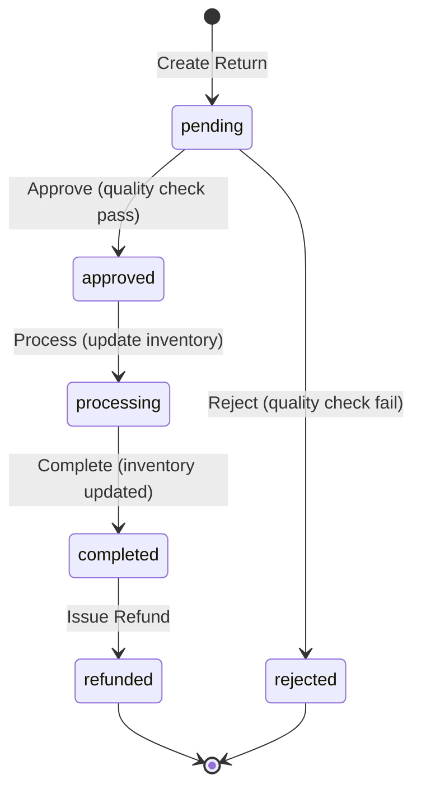
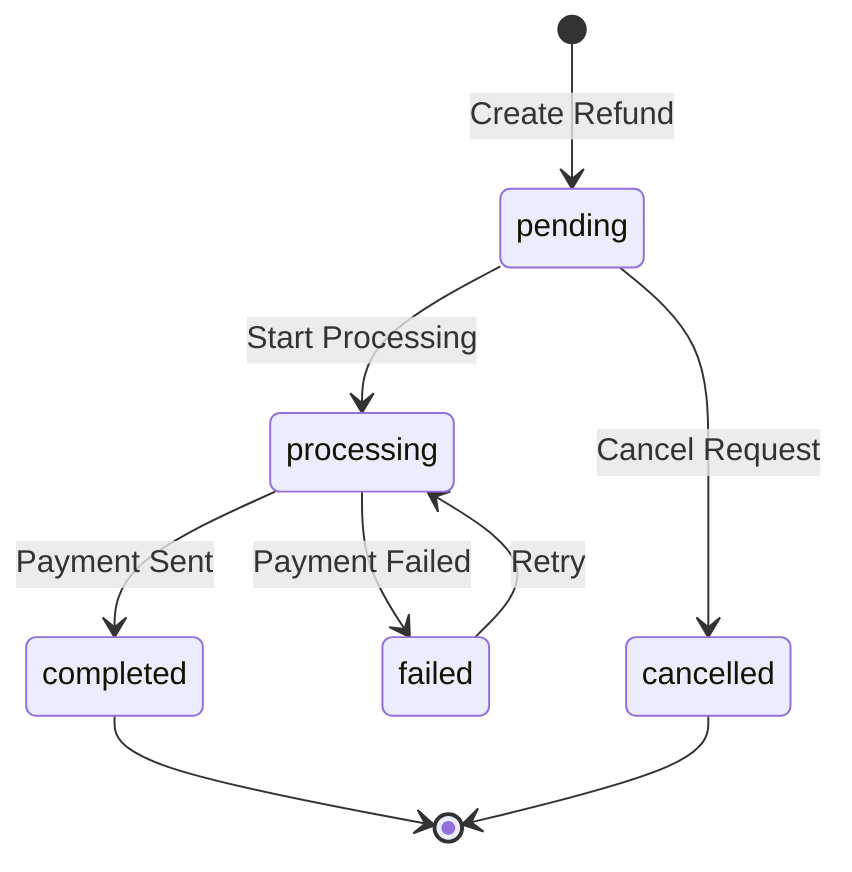

# Product Returns & Exchanges - Complete Frontend Integration Guide

**Date:** February 20, 2026  
**Author:** Backend Team  
**Status:** Production Ready ✅

---

## Table of Contents

1. [Overview](#overview)
2. [Important: Cross-Store Batch Numbers](#important-cross-store-batch-numbers)
3. [Return Workflow](#return-workflow)
4. [Exchange Workflow](#exchange-workflow)
5. [API Endpoints Reference](#api-endpoints-reference)
6. [Status Flow & Transitions](#status-flow--transitions)
7. [Request/Response Examples](#requestresponse-examples)
8. [Cross-Store Returns Handling](#cross-store-returns-handling)
9. [Refund Processing](#refund-processing)
10. [Edge Cases & Best Practices](#edge-cases--best-practices)

---

## Overview

The Returns & Exchanges system handles:
- **Customer returns** (purchased items being returned)
- **Store-to-store returns** (cross-location inventory transfers via returns)
- **Exchanges** (return + refund + new order in one flow)
- **Partial returns** (returning some items from an order)
- **Multi-step approval workflow** (quality check → approval → processing → refund)

### Key Features

✅ **Cross-store returns supported** - Product bought at Shop A can be returned to Shop B  
✅ **Quality inspection workflow** - Returns go through quality checks  
✅ **Flexible refund adjustments** - Employees can adjust refund amounts and processing fees  
✅ **Batch tracking** - Items tracked by batch numbers across stores  
✅ **Status history** - Complete audit trail of all status changes  
✅ **Multiple refund methods** - Cash, bank transfer, mobile banking, store credit  

---

## Important: Cross-Store Batch Numbers

### ⚠️ Critical Information About Batch Numbers

**As of February 20, 2026**, we fixed a database constraint issue to properly support cross-store returns:

#### What Changed?

**Before:**
- `batch_number` was globally unique across all stores
- **Problem:** When returning a product to a different store than where it was purchased, the system couldn't create a batch with the same `batch_number` at the new store
- **Error:** `SQLSTATE[23000]: Integrity constraint violation: 1062 Duplicate entry for key 'product_batches_batch_number_unique'`

**After (Current Fix):**
- `batch_number` now has a **compound unique constraint**: `(product_id, batch_number, store_id)`
- **Result:** Same `batch_number` can exist in multiple stores while preventing duplicates within the same store

#### Why Keep Same Batch Numbers Across Stores?

**Business Reasoning:**
- ✅ **Inventory tracking** - Tracks the same logical batch across locations
- ✅ **Traceability** - Easy to trace which batch was originally purchased
- ✅ **Reporting consistency** - Better reporting on batch performance across stores
- ✅ **Quality tracking** - If a batch has quality issues, it's tracked by batch_number regardless of location

#### Does This Cause Any Issues?

**No**. Analysis of the entire codebase confirms:

✅ **All batch queries filter by `product_id` and/or `store_id`** - No code assumes batch_number is globally unique  
✅ **Cross-store return logic intentionally preserves batch_number** - This is by design  
✅ **Compound unique constraint prevents actual duplicates** - Can't have same product+batch+store twice  
✅ **No breaking changes** - All existing functionality works correctly  

#### Alternative Approach (If Needed)

If business requirements change, we can generate **new unique batch numbers** for cross-store returns instead:

```php
// Alternative implementation (NOT currently used)
$targetBatch = \App\Models\ProductBatch::firstOrCreate([
    'product_id' => $item['product_id'],
    'store_id' => $returnStore,
    'batch_number' => 'XSTORE-' . $originalBatch->batch_number . '-' . $returnStore,
], [
    // ... batch details
]);
```

**Current decision:** Keep same batch_number for better tracking. Safe and intentional.

---

## Return Workflow

### Complete 7-Step Return Process

```
┌─────────────┐
│ 1. PENDING  │ ← Return initiated by customer/employee
└──────┬──────┘
       │ Employee performs quality check
       ↓
┌─────────────┐
│ 2. APPROVED │ ← Quality check passed, ready for processing
└──────┬──────┘
       │ OR
       │
       ↓
┌─────────────┐
│ REJECTED    │ ← Quality check failed or invalid return
└─────────────┘

From APPROVED:
       ↓
┌──────────────┐
│ 3. PROCESSING│ ← Inventory being updated, barcodes reassigned
└──────┬───────┘
       │ Inventory added back to store
       ↓
┌─────────────┐
│ 4. COMPLETED│ ← Return processed, ready for refund
└──────┬──────┘
       │ Refund issued to customer
       ↓
┌─────────────┐
│ 5. REFUNDED │ ← Money returned to customer (final state)
└─────────────┘
```

### What Happens at Each Step

| Step | Status | Actions Performed | Who Can Trigger |
|------|--------|-------------------|-----------------|
| 1 | `pending` | Return request created, items logged | Customer/Employee |
| 2 | `approved` | Quality check passed, refund amount finalized | Employee with `returns.approve` |
| 3 | `processing` | Batch quantities updated, barcodes reassigned, product movements logged | Employee with `returns.process` |
| 4 | `completed` | Return fully processed, inventory updated | System (automatic) |
| 5 | `refunded` | Money returned to customer via chosen method | Employee with `refunds.process` |
| - | `rejected` | Return denied, no inventory changes | Employee with `returns.approve` |

---

## Exchange Workflow

**Exchange = Return + Refund + New Order**

### Process Flow

```
Customer wants to exchange Product A for Product B

Step 1: CREATE RETURN
   POST /api/returns
   → Return Product A (status: pending)

Step 2: APPROVE RETURN
   POST /api/returns/{id}/approve
   → Quality check Product A

Step 3: CREATE REFUND
   POST /api/refunds
   → Issue refund (usually store credit for instant exchange)

Step 4: CREATE NEW ORDER
   POST /api/orders
   → New order for Product B
   → Use store credit from Step 3 to pay

Step 5: PROCESS RETURN
   POST /api/returns/{id}/process
   → Add Product A back to inventory
```

### Frontend Implementation Tips

**Option 1: Separate Flow (Recommended)**
```javascript
// 1. Customer initiates exchange
const returnResponse = await createReturn({
  order_id: originalOrder.id,
  items: [{ order_item_id: itemA.id, quantity: 1 }],
  return_reason: 'exchange'
});

// 2. Employee approves return
const approveResponse = await approveReturn(returnResponse.data.id);

// 3. Issue store credit refund
const refundResponse = await createRefund({
  return_id: returnResponse.data.id,
  refund_method: 'store_credit'
});

// 4. Create new order with store credit
const newOrderResponse = await createOrder({
  items: [{ product_id: productB.id, quantity: 1 }],
  payment_method_id: storeCreditMethodId,
  store_credit_code: refundResponse.data.store_credit_code
});

// 5. Process the return
await processReturn(returnResponse.data.id);
```

**Option 2: Unified Exchange Workflow (Future Enhancement)**
Could create a dedicated `POST /api/exchanges` endpoint that handles all steps atomically.

---

## API Endpoints Reference

### Base URL
```
https://your-api-domain.com/api
```

### Authentication
All endpoints require authentication via JWT token:
```
Authorization: Bearer {your-jwt-token}
```

### Permissions Required

| Endpoint | Permission |
|----------|-----------|
| `GET /api/returns` | `returns.view` |
| `POST /api/returns` | `returns.create` |
| `POST /api/returns/{id}/approve` | `returns.approve` |
| `POST /api/returns/{id}/reject` | `returns.approve` |
| `POST /api/returns/{id}/process` | `returns.process` |
| `POST /api/refunds` | `refunds.create` |
| `POST /api/refunds/{id}/process` | `refunds.process` |

---

### 1. List All Returns

**Endpoint:** `GET /api/returns`

**Query Parameters:**
| Parameter | Type | Description |
|-----------|------|-------------|
| `status` | string | Filter by status: `pending`, `approved`, `rejected`, `processing`, `completed`, `refunded` |
| `store_id` | integer | Filter by store ID |
| `customer_id` | integer | Filter by customer ID |
| `from_date` | date | Filter returns from this date (YYYY-MM-DD) |
| `to_date` | date | Filter returns until this date (YYYY-MM-DD) |
| `search` | string | Search by return_number or order_number |
| `sort_by` | string | Sort column (default: `created_at`) |
| `sort_order` | string | `asc` or `desc` (default: `desc`) |
| `per_page` | integer | Items per page (default: 15) |

**Response:**
```json
{
  "success": true,
  "data": {
    "current_page": 1,
    "data": [
      {
        "id": 1,
        "return_number": "RET-20260220-001",
        "order_id": 123,
        "customer_id": 45,
        "store_id": 2,
        "received_at_store_id": 3,
        "return_reason": "defective_product",
        "return_type": "customer_return",
        "status": "approved",
        "return_date": "2026-02-20T10:30:00Z",
        "total_return_value": "5000.00",
        "total_refund_amount": "4500.00",
        "processing_fee": "500.00",
        "quality_check_passed": true,
        "customer": {
          "id": 45,
          "name": "John Doe",
          "phone": "+8801712345678"
        },
        "store": {
          "id": 2,
          "name": "Shop Dhaka"
        },
        "order": {
          "id": 123,
          "order_number": "ORD-20260215-123"
        },
        "refunds": [
          {
            "id": 10,
            "refund_number": "REF-20260220-010",
            "refund_amount": "4500.00",
            "status": "pending"
          }
        ]
      }
    ],
    "total": 45,
    "per_page": 15,
    "last_page": 3
  }
}
```

---

### 2. Get Single Return

**Endpoint:** `GET /api/returns/{id}`

**Response:**
```json
{
  "success": true,
  "data": {
    "id": 1,
    "return_number": "RET-20260220-001",
    "order_id": 123,
    "customer_id": 45,
    "store_id": 2,
    "received_at_store_id": 3,
    "return_reason": "defective_product",
    "return_type": "customer_return",
    "status": "approved",
    "return_date": "2026-02-20T10:30:00Z",
    "received_date": "2026-02-20T11:00:00Z",
    "total_return_value": "5000.00",
    "total_refund_amount": "4500.00",
    "processing_fee": "500.00",
    "customer_notes": "Screen has dead pixels",
    "internal_notes": "Confirmed defect, approved for refund",
    "quality_check_passed": true,
    "quality_check_notes": "Visual inspection confirmed screen defect",
    "return_items": [
      {
        "order_item_id": 456,
        "product_id": 78,
        "product_batch_id": 234,
        "product_name": "Samsung Galaxy S24",
        "quantity": 1,
        "unit_price": "5000.00",
        "total_price": "5000.00",
        "reason": "Screen defect"
      }
    ],
    "status_history": [
      {
        "status": "pending",
        "changed_at": "2026-02-20T10:30:00Z",
        "changed_by": 5,
        "notes": null
      },
      {
        "status": "approved",
        "changed_at": "2026-02-20T11:00:00Z",
        "changed_by": 7,
        "notes": "Quality check passed"
      }
    ],
    "customer": { /*...*/ },
    "order": { /*...*/ },
    "store": { /*...*/ },
    "refunds": [ /*...*/ ]
  }
}
```

---

### 3. Create Return

**Endpoint:** `POST /api/returns`

**Request Body:**
```json
{
  "order_id": 123,
  "received_at_store_id": 3,
  "return_reason": "defective_product",
  "return_type": "customer_return",
  "items": [
    {
      "order_item_id": 456,
      "quantity": 1,
      "reason": "Screen has dead pixels"
    }
  ],
  "customer_notes": "Customer reported screen issue within 7 days",
  "attachments": [
    {
      "type": "image",
      "url": "https://storage.example.com/defect-photo.jpg"
    }
  ]
}
```

**Valid `return_reason` Values:**
- `defective_product`
- `wrong_item`
- `not_as_described`
- `customer_dissatisfaction`
- `size_issue`
- `color_issue`
- `quality_issue`
- `late_delivery`
- `changed_mind`
- `duplicate_order`
- `other`

**Valid `return_type` Values:**
- `customer_return` (default)
- `store_return`
- `warehouse_return`

**Response:**
```json
{
  "success": true,
  "message": "Return created successfully",
  "data": {
    "id": 1,
    "return_number": "RET-20260220-001",
    "status": "pending",
    /* ... full return object */
  }
}
```

**Error Cases:**
```json
// Duplicate return exists
{
  "success": false,
  "message": "Failed to create return: A return request (#RET-20260219-045) already exists for this order. Cannot create duplicate returns."
}

// Quantity exceeds available
{
  "success": false,
  "message": "Failed to create return: Cannot return 5 units. Only 3 available for return."
}
```

---

### 4. Approve Return

**Endpoint:** `POST /api/returns/{id}/approve`

**Request Body:**
```json
{
  "total_refund_amount": 4500.00,
  "processing_fee": 500.00,
  "internal_notes": "Quality check passed, approved for 90% refund due to opened packaging"
}
```

**Response:**
```json
{
  "success": true,
  "message": "Return approved successfully",
  "data": {
    "id": 1,
    "status": "approved",
    "approved_date": "2026-02-20T11:30:00Z",
    "approved_by": 7
  }
}
```

---

### 5. Reject Return

**Endpoint:** `POST /api/returns/{id}/reject`

**Request Body:**
```json
{
  "rejection_reason": "Product shows signs of intentional damage. Does not qualify for return as per policy."
}
```

**Response:**
```json
{
  "success": true,
  "message": "Return rejected successfully",
  "data": {
    "id": 1,
    "status": "rejected",
    "rejected_date": "2026-02-20T11:30:00Z",
    "rejected_by": 7,
    "rejection_reason": "Product shows signs of intentional damage..."
  }
}
```

---

### 6. Process Return (Inventory Update)

**Endpoint:** `POST /api/returns/{id}/process`

**Important:** This endpoint updates inventory. Only call after approval and quality verification.

**Request Body:** (Optional)
```json
{
  "internal_notes": "Processed and added back to Shop B inventory"
}
```

**What Happens:**
1. ✅ Batch quantities updated (`product_batches.quantity` incremented)
2. ✅ Barcodes reassigned to new store location
3. ✅ Product movements logged for audit trail
4. ✅ Cross-store batches created if needed (with same `batch_number`)
5. ✅ Status changed to `processing` → `completed`

**Response:**
```json
{
  "success": true,
  "message": "Return processed successfully",
  "data": {
    "id": 1,
    "status": "processing",
    "processed_date": "2026-02-20T12:00:00Z",
    "processed_by": 8
  }
}
```

---

### 7. Quality Check

**Endpoint:** `POST /api/returns/{id}/quality-check`

**Request Body:**
```json
{
  "quality_check_passed": true,
  "quality_check_notes": "Product inspected. No visible damage. Original packaging intact."
}
```

**Response:**
```json
{
  "success": true,
  "message": "Quality check recorded successfully",
  "data": {
    "id": 1,
    "quality_check_passed": true,
    "quality_check_notes": "Product inspected...",
    "received_date": "2026-02-20T10:45:00Z"
  }
}
```

---

### 8. Get Return Statistics

**Endpoint:** `GET /api/returns/statistics`

**Query Parameters:**
- `store_id` (optional)
- `from_date` (optional)
- `to_date` (optional)

**Response:**
```json
{
  "success": true,
  "data": {
    "total_returns": 150,
    "pending_returns": 25,
    "approved_returns": 30,
    "rejected_returns": 10,
    "completed_returns": 85,
    "total_return_value": "750000.00",
    "total_refunded_amount": "680000.00",
    "average_processing_time_hours": 18.5,
    "return_rate_percentage": 5.2
  }
}
```

---

## Cross-Store Returns Handling

### Scenario: Product Purchased at Shop A, Returned to Shop B

**Example Flow:**

1. **Customer purchases product at Shop A (Dhaka)**
   - Product from `ProductBatch` ID 100
   - `batch_number`: `BATCH-20260210-ABC123`
   - `store_id`: 1 (Shop A)

2. **Customer returns product to Shop B (Chittagong)**
   - Creates return with `received_at_store_id`: 2 (Shop B)

3. **Employee approves return**
   - `POST /api/returns/{id}/approve`

4. **System processes return** (`POST /api/returns/{id}/process`)
   
   **Backend automatically:**
   ```php
   // Check if returning to different store
   if ($originalBatch->store_id != $returnStore) {
       // Find or create batch at return store (Shop B)
       // with SAME batch_number
       $targetBatch = ProductBatch::firstOrCreate([
           'product_id' => $productId,
           'store_id' => 2, // Shop B
           'batch_number' => 'BATCH-20260210-ABC123', // Same as original
       ], [
           'quantity' => 0,
           'cost_price' => $originalBatch->cost_price,
           'sell_price' => $originalBatch->sell_price,
           // ... copy other batch details
       ]);
       
       // Increment quantity at Shop B
       $targetBatch->increment('quantity', 1);
       
       // Update barcode location to Shop B
       $barcode->update(['batch_id' => $targetBatch->id]);
   }
   ```

5. **Result:**
   - Shop A: `ProductBatch` ID 100, `batch_number: BATCH-20260210-ABC123`, `store_id: 1`, `quantity: 49` (decreased)
   - Shop B: `ProductBatch` ID 345, `batch_number: BATCH-20260210-ABC123`, `store_id: 2`, `quantity: 1` (new batch created)

### Frontend Display Recommendations

**Show Cross-Store Indicator:**
```javascript
if (returnItem.received_at_store_id !== returnItem.store_id) {
  // Display warning/info message
  console.log(`Cross-store return: Purchased at Store ${returnItem.store_id}, Returned to Store ${returnItem.received_at_store_id}`);
  
  // Show in UI
  <Badge color="info">Cross-Store Return</Badge>
}
```

**Movement Logging:**
```javascript
// Check product_movements table for audit trail
GET /api/products/{id}/movements?movement_type=cross_store_return
```

---

## Refund Processing

### Refund Flow (Separate from Returns)

Returns track the **physical product** coming back.  
Refunds track the **money** going back to customer.

### Create Refund

**Endpoint:** `POST /api/refunds`

**Request Body:**
```json
{
  "return_id": 1,
  "order_id": 123,
  "customer_id": 45,
  "refund_type": "full",
  "refund_amount": 4500.00,
  "refund_method": "mobile_banking",
  "refund_method_details": {
    "provider": "bKash",
    "account_number": "+8801712345678"
  },
  "internal_notes": "Refund approved by manager"
}
```

**Valid `refund_method` Values:**
- `cash`
- `bank_transfer`
- `mobile_banking`
- `store_credit`
- `original_payment_method`

**Valid `refund_type` Values:**
- `full`
- `partial`
- `exchange_credit`

**Response:**
```json
{
  "success": true,
  "message": "Refund created successfully",
  "data": {
    "id": 10,
    "refund_number": "REF-20260220-010",
    "status": "pending",
    "refund_amount": "4500.00",
    "refund_method": "mobile_banking",
    "store_credit_code": null
  }
}
```

---

### Process Refund

**Endpoint:** `POST /api/refunds/{id}/process`

**Request Body:**
```json
{
  "transaction_reference": "bKash-TXN-123456789",
  "bank_reference": null,
  "gateway_reference": null
}
```

**Response:**
```json
{
  "success": true,
  "message": "Refund processed successfully",
  "data": {
    "id": 10,
    "status": "processing",
    "processed_at": "2026-02-20T14:00:00Z",
    "processed_by": 8
  }
}
```

---

### Complete Refund

**Endpoint:** `POST /api/refunds/{id}/complete`

**Request Body:**
```json
{
  "transaction_reference": "bKash-TXN-123456789"
}
```

**Response:**
```json
{
  "success": true,
  "message": "Refund completed successfully",
  "data": {
    "id": 10,
    "status": "completed",
    "completed_at": "2026-02-20T14:30:00Z",
    "transaction_reference": "bKash-TXN-123456789"
  }
}
```

---

## Status Flow & Transitions

### Return Status Lifecycle



### Refund Status Lifecycle



### Valid Status Transitions

**Returns:**
| From | To | Required Action |
|------|-----|-----------------|
| `pending` | `approved` | `POST /api/returns/{id}/approve` |
| `pending` | `rejected` | `POST /api/returns/{id}/reject` |
| `approved` | `processing` | `POST /api/returns/{id}/process` |
| `processing` | `completed` | Automatic (after inventory update) |
| `completed` | `refunded` | After successful refund completion |

**Refunds:**
| From | To | Required Action |
|------|-----|-----------------|
| `pending` | `processing` | `POST /api/refunds/{id}/process` |
| `processing` | `completed` | `POST /api/refunds/{id}/complete` |
| `processing` | `failed` | Payment gateway failure |

---

## Edge Cases & Best Practices

### 1. Partial Returns

**Scenario:** Customer wants to return 2 out of 5 items from an order.

**Implementation:**
```javascript
// Return only specific items
POST /api/returns
{
  "order_id": 123,
  "items": [
    { "order_item_id": 456, "quantity": 2 },
    // Don't include order_item_id 457, 458
  ]
}
```

✅ System validates that returned quantity doesn't exceed purchased quantity  
✅ Remaining items stay with customer

---

### 2. Multiple Returns for Same Order

**Rule:** Only ONE active return allowed per order.

**Scenario:** Customer already has a pending return, tries to create another.

**Error Response:**
```json
{
  "success": false,
  "message": "A return request (#RET-20260219-045) already exists for this order. Cannot create duplicate returns."
}
```

**Workaround:** 
- Complete or reject the existing return first
- Or update the existing return to add more items

---

### 3. Adjusting Refund Amount

**Scenario:** Product returned but packaging opened, give 80% refund instead of 100%

**Implementation:**
```javascript
// During approval, adjust refund amount
POST /api/returns/{id}/approve
{
  "total_refund_amount": 4000.00,  // Original was 5000.00
  "processing_fee": 1000.00,        // 20% deduction
  "internal_notes": "Product usable but opened packaging, 80% refund as per policy"
}
```

✅ Frontend should show:
- Original value: ৳5,000
- Processing fee: ৳1,000
- Refund amount: ৳4,000

---

### 4. Store Credit for Exchanges

**Recommended Flow:**
```javascript
// 1. Approve return
await approveReturn(returnId);

// 2. Create refund as store credit
const refund = await createRefund({
  return_id: returnId,
  refund_method: 'store_credit',
  refund_amount: 5000.00
});

// 3. Frontend receives store_credit_code
console.log(refund.data.store_credit_code); // "SC-20260220-ABC123"

// 4. Customer uses code for new purchase
await createOrder({
  items: [...],
  payment_methods: [
    {
      payment_method_id: storeCreditMethodId,
      amount: 5000.00,
      reference: refund.data.store_credit_code
    }
  ]
});
```

---

### 5. Cross-Store Return Validation

**Frontend Checklist:**

```javascript
// When creating return, show warning if cross-store
if (selectedStoreId !== order.store_id) {
  showWarning(`
    Cross-Store Return Detected:
    - Original purchase: ${order.store.name}
    - Return location: ${selectedStore.name}
    
    The product will be added to ${selectedStore.name} inventory.
    Batch tracking will be maintained.
  `);
}
```

**No special API handling required** - backend handles cross-store logic automatically.

---

### 6. Quality Check Best Practices

**Recommended UI Flow:**

```javascript
// Step 1: Receive product physically
POST /api/returns/{id}/quality-check
{
  "quality_check_passed": true,
  "quality_check_notes": "Inspected by: John Doe\nCondition: Excellent\nPackaging: Intact"
}

// Step 2: If pass, enable "Approve" button
if (return.quality_check_passed) {
  enableApproveButton();
} else {
  enableRejectButton();
  showField('rejection_reason');
}
```

---

### 7. Checking Returnable Quantity

**Before creating return, validate available quantity:**

```javascript
// Backend tracks how much has already been returned
GET /api/orders/{id}

// Response includes:
{
  "items": [
    {
      "id": 456,
      "quantity": 5,
      "returned_quantity": 2,  // Already returned
      "returnable_quantity": 3  // Can still return
    }
  ]
}

// Frontend validation
if (returnQuantity > item.returnable_quantity) {
  showError(`Can only return ${item.returnable_quantity} units`);
}
```

---

### 8. Refund Timing

**Best Practice:** Don't create refund immediately with return.

**Recommended Flow:**
```
1. Create return (pending)
2. Perform quality check
3. Approve return (approved)
4. Process return (processing → completed)
5. NOW create refund
6. Process refund payment
7. Complete refund
8. Return status → refunded
```

This ensures inventory is updated before money leaves the system.

---

### 9. Handling Failed Refunds

**Scenario:** bKash payment fails

```javascript
POST /api/refunds/{id}/complete
// Response:
{
  "success": false,
  "message": "Payment gateway error: Insufficient merchant balance"
}

// Refund status becomes "failed"

// Retry later:
POST /api/refunds/{id}/process  // Re-initiate
POST /api/refunds/{id}/complete // Try again
```

---

### 10. Return Number Format

**Auto-generated:** `RET-YYYYMMDD-XXX`

Example: `RET-20260220-001`

- `RET`: Prefix for returns
- `20260220`: Date (February 20, 2026)
- `001`: Sequential number for that day

**Refund Number Format:** `REF-YYYYMMDD-XXX`

---

## Frontend Integration Checklist

### ✅ Return Creation Page

- [ ] Order lookup by order_number
- [ ] Display order items with quantities
- [ ] Allow selecting items to return
- [ ] Validate returnable quantity
- [ ] Dropdown for return_reason
- [ ] Store selection for cross-store returns
- [ ] Customer notes textarea
- [ ] Image upload for attachments

### ✅ Return Detail Page

- [ ] Display return status with color coding
- [ ] Show status history timeline
- [ ] Quality check form (if pending)
- [ ] Approve/Reject buttons (if pending)
- [ ] Process button (if approved)
- [ ] Refund creation button (if completed)
- [ ] Cross-store indicator badge
- [ ] Link to original order
- [ ] Print return receipt

### ✅ Returns List Page

- [ ] Filter by status
- [ ] Filter by store
- [ ] Filter by date range
- [ ] Search by return_number or order_number
- [ ] Status badges with colors
- [ ] Quick actions (approve, process)
- [ ] Bulk operations checkbox

### ✅ Refund Management

- [ ] Create refund form
- [ ] Refund method selection
- [ ] Store credit code generation
- [ ] Payment reference input
- [ ] Process/Complete buttons
- [ ] Failed refund retry option

---

## Testing Scenarios

### Scenario 1: Simple Same-Store Return

```bash
# Create order
POST /api/orders → Order #123 at Store 1

# Create return
POST /api/returns
{
  "order_id": 123,
  "items": [{"order_item_id": 456, "quantity": 1}]
}

# Approve
POST /api/returns/1/approve

# Process
POST /api/returns/1/process

# Create refund
POST /api/refunds
{
  "return_id": 1,
  "refund_method": "cash"
}

# Complete refund
POST /api/refunds/1/complete
```

✅ **Expected:** Inventory +1 at Store 1, customer gets cash refund

---

### Scenario 2: Cross-Store Return

```bash
# Order at Store 1, return at Store 2
POST /api/returns
{
  "order_id": 123,
  "received_at_store_id": 2,  # Different store
  "items": [{"order_item_id": 456, "quantity": 1}]
}

POST /api/returns/1/approve
POST /api/returns/1/process
```

✅ **Expected:** 
- Store 1: Batch quantity -1
- Store 2: New batch created with same batch_number, quantity +1
- Product movement logged as `cross_store_return`

---

### Scenario 3: Exchange

```bash
# Step 1: Return Product A
POST /api/returns → Return ID 1

# Step 2: Approve
POST /api/returns/1/approve

# Step 3: Create store credit refund
POST /api/refunds
{
  "return_id": 1,
  "refund_method": "store_credit"
}
→ Receive store_credit_code: "SC-20260220-ABC"

# Step 4: Create new order with store credit
POST /api/orders
{
  "items": [{"product_id": 999, "quantity": 1}],
  "payments": [
    {
      "method": "store_credit",
      "code": "SC-20260220-ABC",
      "amount": 5000
    }
  ]
}

# Step 5: Process original return
POST /api/returns/1/process
```

✅ **Expected:** Product A back in inventory, Product B sold to customer, no money exchanged

---

## Support & Troubleshooting

### Common Errors

**Error:** `"Cannot return X units. Only Y available for return"`
- **Cause:** Trying to return more than purchased
- **Fix:** Check `returnable_quantity` in order item

**Error:** `"A return request already exists for this order"`
- **Cause:** Duplicate return attempt
- **Fix:** Complete/reject existing return first, or add items to existing return

**Error:** `"Can only update pending or approved returns"`
- **Cause:** Trying to modify a processed return
- **Fix:** Returns can only be edited before processing

**Error:** `"Duplicate entry for key 'product_batches_batch_number_unique'"`
- **Status:** ✅ **FIXED** (February 20, 2026)
- **Cause:** Old database constraint
- **Fix:** Migration applied, cross-store returns now work

---

## Migration Notes

**Database Migration:** `2026_02_19_190121_fix_product_batches_batch_number_unique_constraint.php`

**What Changed:**
```sql
-- Removed
ALTER TABLE product_batches DROP INDEX product_batches_batch_number_unique;

-- Added
ALTER TABLE product_batches ADD UNIQUE KEY product_batch_store_unique (product_id, batch_number, store_id);
```

**Impact:** ✅ Cross-store returns now work without errors  
**Rollback:** Migration includes down() method to restore original constraint if needed

---

## Summary

✅ **Returns & Exchanges** fully functional  
✅ **Cross-store returns** supported with batch tracking  
✅ **Quality checks** enforce product standards  
✅ **Flexible refunds** with multiple payment methods  
✅ **Complete audit trail** via status_history  
✅ **Batch numbers** preserved across stores for tracking  

**Questions?** Contact backend team or check `/docs` folder for more guides.

---

**Last Updated:** February 20, 2026  
**Migration Applied:** 2026_02_19_190121  
**Status:** ✅ Production Ready
